# 🚀 Subscription System

A scalable subscription system built with Clean Architecture — Node.js/Express REST API + React/TypeScript frontend. Features payment simulation, webhook notifications with retry pattern, and a real-time status dashboard.

[](https://github.com/W1lson17/subscription-system)
[](https://github.com/W1lson17/subscription-system)
[](https://github.com/W1lson17/subscription-system)
[](https://www.typescriptlang.org/)
[](https://nodejs.org/)
[](https://react.dev/)

---

## 📋 Table of Contents

- [Overview](#overview)
- [Architecture](#architecture)
- [Tech Stack](#tech-stack)
- [Getting Started](#getting-started)
- [Running with Docker](#running-with-docker)
- [Running Tests](#running-tests)
- [API Documentation](#api-documentation)
- [Scaling to Production](#scaling-to-production)
- [CI/CD](#cicd)
- [Project Structure](#project-structure)

---

## Overview

This system allows users to subscribe to a premium service by submitting their personal data and a simulated payment method. On successful payment:

1. The subscription is persisted in PostgreSQL with status `ACTIVE`
2. An external webhook is notified (with exponential backoff retry on failure)
3. The user is redirected to a dashboard showing their subscription details

---

## Architecture

The project follows **Clean Architecture** principles on both backend and frontend, ensuring each layer has a single responsibility and dependencies only point inward.

### Backend Layers

```
┌─────────────────────────────────────────────┐
│                   API Layer                  │  ← HTTP, Controllers, Validation
├─────────────────────────────────────────────┤
│              Application Layer               │  ← Use Cases, DTOs
├─────────────────────────────────────────────┤
│                Domain Layer                  │  ← Entities, Ports (interfaces)
├─────────────────────────────────────────────┤
│             Infrastructure Layer             │  ← PostgreSQL, Webhook, DI Container
└─────────────────────────────────────────────┘
```

**Dependency Rule:** Outer layers depend on inner layers. The domain layer has zero external dependencies.

### Frontend Layers

```
┌─────────────────────────────────────────────┐
│             Presentation Layer               │  ← React Components, Pages, Router
├─────────────────────────────────────────────┤
│             Application Layer                │  ← TanStack Query Hooks, Zustand Store
├─────────────────────────────────────────────┤
│               Domain Layer                   │  ← TypeScript Types, Interfaces
├─────────────────────────────────────────────┤
│            Infrastructure Layer              │  ← Axios Client, Repository
└─────────────────────────────────────────────┘
```

### Architecture Diagram

```mermaid
flowchart TD
    User([👤 User]) -->|HTTP Request| Nginx[Nginx :80]
    Nginx -->|/api proxy_pass| Backend[Node.js :3000]
    Nginx -->|Static files| Frontend[React SPA]
    Backend -->|Read/Write| DB[(PostgreSQL)]
    Backend -->|Webhook notification| Webhook[External Webhook Service]
    Webhook -->|Retry on failure| Webhook

    subgraph Docker Network
        Nginx
        Backend
        DB
    end
```



### Key Technical Decisions

**Why Clean Architecture?**
Separating concerns makes each layer independently testable. The domain layer has no external dependencies — it can be tested without a database, without HTTP, without React.

**Why TanStack Query + Zustand?**
TanStack Query handles server state (fetching, caching, retrying). Zustand handles client state (UI notifications, current subscription). Different tools for different purposes — they don't overlap.

**Why the Retry Pattern?**
External webhook services can fail temporarily (network issues, 5xx errors). Instead of losing the notification, the system retries with exponential backoff: `delay = retryDelay * attemptNumber`. This avoids overwhelming a struggling service while still delivering the notification.

---

## Tech Stack

### Backend
| Technology | Version | Purpose |
|------------|---------|---------|
| Node.js | 24 | Runtime |
| Express | 5 | HTTP Framework |
| TypeScript | 5.9 | Language |
| PostgreSQL | 18 | Database |
| pg (node-postgres) | 8 | DB Driver |
| Zod | 4 | Validation |
| Axios | 1 | HTTP Client (Webhook) |
| Jest + ts-jest | 30 | Testing |
| Supertest | 7 | Integration Testing |

### Frontend
| Technology | Version | Purpose |
|------------|---------|---------|
| React | 19 | UI Framework |
| TypeScript | 5.9 | Language |
| Vite | 7 | Build Tool |
| TanStack Query | 5 | Server State |
| Zustand | 5 | Client State |
| React Hook Form | 7 | Form Management |
| Zod | 4 | Form Validation |
| Tailwind CSS | 4 | Styling |
| Shadcn/ui | latest | UI Components |
| React Router | 7 | Routing |
| Axios | 1 | HTTP Client |
| Sonner | 2 | Toast Notifications |
| Vitest | 4 | Testing |
| Nginx | 1.29.5 | Production Server |

---

## Getting Started

### Prerequisites

- Node.js 20+
- pnpm 10+
- Docker Desktop

### 1. Clone the repository

```bash
git clone https://github.com/W1lson17/subscription-system.git
cd subscription-system
```

### 2. Install dependencies

```bash
pnpm install
```

### 3. Configure environment variables

```bash
# Root — for Docker Compose interpolation
cp .env.example .env

# Backend
cp backend/.env.example backend/.env

# Frontend
cp frontend/.env.example frontend/.env
```

Edit `backend/.env` with your values:

```env
PORT=3000
DB_HOST=localhost
DB_PORT=5432
DB_USER=postgres
DB_PASSWORD=postgres
DB_NAME=subscriptions_db
WEBHOOK_URL=https://webhook.site/your-unique-id
WEBHOOK_TIMEOUT_MS=5000
WEBHOOK_MAX_RETRIES=3
WEBHOOK_RETRY_DELAY_MS=1000
```

### 4. Start the database

```bash
docker-compose --env-file ./backend/.env up -d
```

### 5. Start the backend

```bash
cd backend
pnpm dev
```

### 6. Start the frontend

```bash
cd frontend
pnpm dev
```

Open [http://localhost:5173](http://localhost:5173)

---

## Running with Docker

The entire system (PostgreSQL + Backend + Frontend) can be run with a single command.

### 1. Configure production environment

```bash
cp .env.prod.example .env.prod
```

Edit `.env.prod`:

```env
DB_USER=postgres
DB_PASSWORD=your_secure_password
DB_NAME=subscriptions_db
DB_PORT=5432
WEBHOOK_URL=https://your-webhook-url.com/webhook
WEBHOOK_TIMEOUT_MS=5000
WEBHOOK_MAX_RETRIES=3
WEBHOOK_RETRY_DELAY_MS=1000
PORT=3000
```

### 2. Build and start

```bash
docker-compose -f docker-compose.prod.yml --env-file .env.prod up -d
```

### 3. Verify

```bash
docker-compose -f docker-compose.prod.yml ps
```

Open [http://localhost:8080](http://localhost:8080)

### How it works in Docker

```
Browser → Nginx :8080
           ├── /api/* → proxy_pass → Backend :3000
           └── /*     → React SPA (index.html)
```

Nginx acts as the single entry point. The browser never calls the backend directly — all API requests go through Nginx, which forwards them to the backend container inside the Docker network.

---

## Running Tests

### Backend

```bash
cd backend

# Unit tests with coverage
pnpm test

# Integration tests (requires Docker PostgreSQL running)
pnpm test:integration

# All tests
pnpm test:all
```

**Results:** 45 tests passing, 98.79% coverage

### Frontend

```bash
cd frontend

# Unit tests with coverage
pnpm test

# Watch mode
pnpm test:watch
```

**Results:** 19 tests passing, 100% coverage on tested files

---

## API Documentation

### Health Check

```
GET /health
```

Response:
```json
{
  "status": "ok",
  "timestamp": "2026-02-26T00:00:00.000Z"
}
```

### Create Subscription

```
POST /api/subscriptions
```

Request body:
```json
{
  "userId": "user-123",
  "userName": "John Doe",
  "userEmail": "john@example.com",
  "paymentMethod": "CREDIT_CARD",
  "amount": 99.99
}
```

Payment methods: `CREDIT_CARD` | `DEBIT_CARD` | `PAYPAL`

Response `201`:
```json
{
  "id": "uuid",
  "userId": "user-123",
  "userName": "John Doe",
  "userEmail": "john@example.com",
  "status": "ACTIVE",
  "paymentMethod": "CREDIT_CARD",
  "amount": 99.99,
  "startDate": "2026-02-26T00:00:00.000Z",
  "endDate": "2027-02-26T00:00:00.000Z",
  "createdAt": "2026-02-26T00:00:00.000Z"
}
```

Error responses:
- `400` — Validation error (invalid fields)
- `409` — User already has an active subscription
- `500` — Internal server error

### Get Subscription

```
GET /api/subscriptions/:id
```

Response `200`: Same as create response
Error `404`: Subscription not found

---

## Scaling to Production

### Current Architecture Limitation

The current implementation processes subscriptions synchronously — the API waits for the webhook notification before responding. At high volume (10,000 subscriptions/second), this becomes a bottleneck.

### Solution: Message Queue (RabbitMQ / Kafka)

```
┌──────────┐    ┌──────────┐    ┌─────────────┐    ┌─────────────────┐
│  API     │───▶│  Queue   │───▶│  Consumers  │───▶│  Webhook Service│
│ (saves   │    │(RabbitMQ/│    │  (N workers)│    │  (external)     │
│  to DB)  │    │  Kafka)  │    │             │    │                 │
└──────────┘    └──────────┘    └─────────────┘    └─────────────────┘
     ↑                                ↑
  Responds                     Process webhook
  immediately                  notifications
  to user                      asynchronously
```

**How it works:**
1. API receives subscription request
2. Saves to DB and immediately responds `201` to the user
3. Publishes a `subscription.created` event to the queue
4. N consumer workers process the queue and send webhook notifications
5. Failed notifications are retried automatically by the queue

**Horizontal scaling with Docker/Kubernetes:**
---

## CI/CD

### GitHub Actions Pipeline

```yaml
name: CI

on: [push, pull_request]

jobs:
  backend-tests:
    runs-on: ubuntu-latest
    services:
      postgres:
        image: postgres:18-alpine
        env:
          POSTGRES_USER: postgres
          POSTGRES_PASSWORD: postgres
          POSTGRES_DB: subscriptions_test_db
        ports:
          - 5433:5432
    steps:
      - uses: actions/checkout@v4
      - uses: pnpm/action-setup@v4
      - run: pnpm install
      - run: cd backend && pnpm test:all

  frontend-tests:
    runs-on: ubuntu-latest
    steps:
      - uses: actions/checkout@v4
      - uses: pnpm/action-setup@v4
      - run: pnpm install
      - run: cd frontend && pnpm test

  build:
    needs: [backend-tests, frontend-tests]
    runs-on: ubuntu-latest
    steps:
      - uses: actions/checkout@v4
      - run: docker build -t subscription-backend -f backend/Dockerfile .
      - run: docker build -t subscription-frontend -f frontend/Dockerfile .
```

**Pipeline flow:**
```
Push → Backend Tests → Frontend Tests → Docker Build → Deploy
         (45 tests)      (19 tests)     (multi-stage)
```

---

## Project Structure

```
subscription-system/
├── backend/
│   ├── src/
│   │   ├── api/              # Controllers, Routes, Middlewares, Schemas
│   │   ├── application/      # Use Cases, DTOs
│   │   ├── domain/           # Entities, Ports (interfaces)
│   │   ├── infrastructure/   # PostgreSQL, Webhook, DI Container
│   │   └── shared/           # Errors, Utils, Logger
│   ├── Dockerfile
│   └── package.json
├── frontend/
│   ├── src/
│   │   ├── application/      # TanStack Query Hooks, Zustand Store
│   │   ├── domain/           # TypeScript Types
│   │   ├── infrastructure/   # Axios Client, Repository
│   │   ├── presentation/     # React Components, Pages, Router
│   │   └── lib/              # Formatters, Utils, Zod Resolver
│   ├── Dockerfile
│   ├── nginx.conf
│   └── package.json
├── docker-compose.yml        # Development (PostgreSQL only)
├── docker-compose.prod.yml   # Production (full stack)
├── .env.example
├── .env.prod.example
└── pnpm-workspace.yaml
```